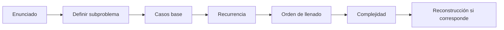

# Programación dinámica

## Objetivo de aprendizaje

Reconocer cuándo un problema de optimización puede resolverse con programación dinámica, formular sus subproblemas, escribir una recurrencia correcta, identificar casos base, elegir un orden de llenado y explicar la complejidad. La página debe evitar que el estudiante memorice código sin entender la estructura del problema.

## Idea central

La programación dinámica es una técnica para resolver problemas que tienen **subproblemas solapados** y **subestructura óptima**.

- Hay subproblemas solapados cuando el mismo cálculo aparece muchas veces si se resuelve el problema recursivamente sin memoria.
- Hay subestructura óptima cuando una solución óptima del problema completo se puede construir usando soluciones óptimas de subproblemas más pequeños.
- La idea práctica es resolver cada subproblema una sola vez, guardar su resultado y reutilizarlo.

La programación dinámica no consiste en llenar una tabla porque sí. La tabla aparece porque primero se definió un subproblema y una recurrencia.

## Antes de partir: vocabulario mínimo

| Concepto | Significado |
|---|---|
| Problema de optimización | Problema donde se busca maximizar o minimizar una cantidad. |
| Subproblema | Versión más pequeña o parcial del problema original. |
| Estado | Parámetros que identifican completamente un subproblema. |
| Recurrencia | Fórmula que expresa un estado usando otros estados más simples. |
| Caso base | Estado cuyo valor se conoce directamente. |
| Memoización | Resolver recursivamente y guardar resultados ya calculados. |
| Bottom-up | Llenar una tabla desde casos pequeños hacia casos grandes. |
| Transición | Opción evaluada para pasar de un estado a otro. |
| Reconstrucción | Recuperar qué decisiones produjeron el valor óptimo. |

## Cuándo usar programación dinámica

Conviene pensar en DP cuando el enunciado tiene señales como:

| Señal en el enunciado | Interpretación |
|---|---|
| “Máximo”, “mínimo”, “mejor costo”, “mayor ganancia” | Probablemente hay una función objetivo. |
| La decisión actual afecta la capacidad, índice, posición o saldo restante | Puede definirse un estado. |
| Hay muchas combinaciones posibles, pero se repiten subcasos | Hay subproblemas solapados. |
| Una estrategia greedy tiene contraejemplos | Puede necesitarse probar opciones y guardar óptimos. |
| Se pregunta por una recurrencia | Normalmente se espera definir subproblema, caso base y transición. |
| Se pregunta por versión iterativa | Se espera llenar una tabla en orden válido. |

## Diferencia con otras técnicas

| Técnica | Qué hace | Diferencia clave con DP |
|---|---|---|
| Greedy | Toma decisiones locales definitivas. | DP compara opciones antes de decidir. |
| Backtracking | Explora asignaciones y puede retroceder. | DP evita repetir subproblemas equivalentes. |
| Dividir y conquistar | Divide en subproblemas disjuntos. | DP aparece cuando los subproblemas se solapan. |
| Fuerza bruta | Prueba muchas posibilidades sin guardar estructura. | DP reutiliza resultados. |

## Checklist para resolver un problema con DP

1. Definir el **subproblema**.
2. Identificar los **parámetros del estado**.
3. Escribir la **recurrencia**.
4. Definir los **casos base**.
5. Decidir si se usará **memoización** o **bottom-up**.
6. Determinar el **orden de llenado**.
7. Calcular la **complejidad** como número de estados por costo de transición.
8. Explicar la **reconstrucción** si se pide la solución y no solo el valor óptimo.

## Plantilla de respuesta para interrogación

Para responder bien una pregunta de DP, conviene escribir:

| Parte | Qué debe decir |
|---|---|
| Subproblema | “Sea DP[...] el valor óptimo de...” |
| Caso base | Qué ocurre cuando no quedan elementos, capacidad, monto o caracteres. |
| Recurrencia | Opciones posibles y operador `min` o `max`. |
| Orden | Desde qué estados pequeños se llena la tabla. |
| Complejidad | Número de estados multiplicado por costo por estado. |
| Reconstrucción | Cómo volver desde el estado final para recuperar decisiones. |

## Pseudocódigo genérico con memoización

**Input:** estado inicial del problema, estructura `M` para guardar resultados.  
**Output:** valor óptimo asociado al estado inicial.

```text
DP_Memo(estado):
    if estado es caso base:
        return valor_base

    if M[estado] != NIL:
        return M[estado]

    mejor <- peor_valor_posible

    for decision in decisiones_validas(estado):
        nuevo_estado <- aplicar(decision, estado)
        candidato <- costo(decision) + DP_Memo(nuevo_estado)
        mejor <- mejor_entre(mejor, candidato)

    M[estado] <- mejor
    return mejor
```

## Pseudocódigo genérico bottom-up

**Input:** dimensiones de la tabla y datos del problema.  
**Output:** valor óptimo del problema completo.

```text
DP_BottomUp(datos):
    inicializar tabla DP con valores base

    for estado in orden_valido:
        DP[estado] <- combinar estados anteriores según recurrencia

    return DP[estado_final]
```

## Cómo calcular complejidad

La complejidad de una DP se calcula normalmente así:

$$
T(n) = \#\text{estados} \cdot \text{costo por transición}
$$

Ejemplo: si la tabla tiene `n` filas y `W` columnas, y cada celda se calcula en tiempo constante, entonces:

$$
T(n, W) \in O(nW)
$$

La memoria suele ser el tamaño de la tabla:

$$
S(n, W) \in O(nW)
$$

A veces puede optimizarse memoria si cada fila depende solo de la fila anterior.

## Ejemplo 1: charlas con ganancia

### Problema

Hay charlas con hora de inicio, hora de término y ganancia. Se quiere seleccionar un subconjunto compatible de charlas que maximice la ganancia total. Dos charlas son compatibles si no se traslapan.

Este problema se parece al interval scheduling greedy, pero **la ganancia cambia el problema**. Elegir la charla que termina antes ya no necesariamente maximiza la ganancia.

### Definición del subproblema

Ordenamos las charlas por hora de término. Sea:

- `v[j]`: ganancia de la charla `j`.
- `b[j]`: índice de la última charla compatible con `j` que termina antes de que comience `j`.
- `OPT(j)`: máxima ganancia usando solo las primeras `j` charlas.

### Recurrencia

Para cada charla `j`, hay dos opciones:

1. Tomar la charla `j`: se gana `v[j]` y se suma lo mejor compatible antes de ella, `OPT(b[j])`.
2. No tomar la charla `j`: se conserva `OPT(j - 1)`.

$$
OPT(j) = \max\{v_j + OPT(b(j)),\ OPT(j - 1)\}
$$

Caso base:

$$
OPT(0) = 0
$$

### Pseudocódigo con memoización

**Input:** arreglo de ganancias `v`, arreglo de compatibilidades `b`, índice `j`, tabla `M`.  
**Output:** máxima ganancia usando las primeras `j` charlas.

```text
RecOpt(j):
    if j = 0:
        return 0

    if M[j] != NIL:
        return M[j]

    tomar <- v[j] + RecOpt(b[j])
    saltar <- RecOpt(j - 1)
    M[j] <- max(tomar, saltar)
    return M[j]
```

### Pseudocódigo bottom-up

**Input:** `n` charlas ordenadas por término, ganancias `v`, compatibilidades `b`.  
**Output:** máxima ganancia total.

```text
ItOpt(n):
    M[0] <- 0

    for j = 1 to n:
        tomar <- v[j] + M[b[j]]
        saltar <- M[j - 1]
        M[j] <- max(tomar, saltar)

    return M[n]
```

### Reconstrucción

**Input:** tabla `M`, ganancias `v`, compatibilidades `b`, índice `j`.  
**Output:** conjunto de charlas escogidas.

```text
ReconstruirCharlas(j):
    if j = 0:
        return empty

    if v[j] + M[b[j]] >= M[j - 1]:
        return ReconstruirCharlas(b[j]) union {j}
    else:
        return ReconstruirCharlas(j - 1)
```

### Complejidad

Si `b[j]` ya está calculado:

| Parte | Complejidad |
|---|---|
| Llenar tabla | `O(n)` |
| Memoria | `O(n)` |
| Reconstrucción | `O(n)` |

Si primero se debe calcular cada `b[j]`, puede hacerse con búsqueda binaria sobre tiempos de término, típicamente en `O(n log n)` después de ordenar.

## Ejemplo 2: mochila 0/1

### Problema

Hay `n` objetos. Cada objeto `i` tiene peso `peso[i]` y valor `valor[i]`. La mochila soporta peso máximo `W`. Cada objeto se puede tomar una vez o no tomarse.

### Diferencia clave con mochila fraccionable

| Problema | Se puede partir un objeto | Técnica típica |
|---|---|---|
| Mochila fraccionable | Sí | Greedy por valor/peso. |
| Mochila 0/1 | No | Programación dinámica. |

### Definición del subproblema

Sea:

$$
DP[i][w] = \text{máximo valor usando los primeros } i \text{ objetos con capacidad } w
$$

### Recurrencia

Para el objeto `i`, hay dos opciones:

1. No tomarlo.
2. Tomarlo, solo si cabe.

$$
DP[i][w] = \max\{DP[i - 1][w],\ DP[i - 1][w - peso_i] + valor_i\}
$$

La segunda opción solo existe si:

$$
w - peso_i \ge 0
$$

Casos base:

$$
DP[0][w] = 0
$$

$$
DP[i][0] = 0
$$

### Pseudocódigo

**Input:** cantidad de objetos `n`, capacidad `W`, arreglos `peso` y `valor`.  
**Output:** máximo valor alcanzable.

```text
Knapsack01(n, W):
    for w = 0 to W:
        DP[0][w] <- 0

    for i = 1 to n:
        DP[i][0] <- 0

    for i = 1 to n:
        for w = 1 to W:
            DP[i][w] <- DP[i - 1][w]

            if w - peso[i] >= 0:
                candidato <- DP[i - 1][w - peso[i]] + valor[i]
                DP[i][w] <- max(DP[i][w], candidato)

    return DP[n][W]
```

### Reconstrucción

**Input:** tabla `DP`, arreglos `peso` y `valor`.  
**Output:** objetos seleccionados.

```text
ReconstruirMochila(i, w):
    if i = 0 or w = 0:
        return empty

    if DP[i][w] = DP[i - 1][w]:
        return ReconstruirMochila(i - 1, w)
    else:
        return ReconstruirMochila(i - 1, w - peso[i]) union {i}
```

### Complejidad

| Recurso | Complejidad |
|---|---|
| Tiempo | `O(nW)` |
| Memoria | `O(nW)` |

Importante: `O(nW)` no siempre es polinomial en el tamaño de entrada binario si `W` puede ser muy grande. Para el nivel de esta evaluación, suele bastar con expresar la complejidad en función de `n` y `W`.

## Ejemplo 3: dar vuelto

### Problema

Se quiere dar un monto `S` usando la menor cantidad posible de monedas. Hay monedas de valores:

$$
\{v_1, v_2, \dots, v_n\}
$$

Se asume cantidad ilimitada de monedas de cada valor.

### Por qué no basta greedy

Si las monedas son `{10, 5, 2, 1}`, elegir siempre la moneda más grande posible funciona. Pero si las monedas son `{6, 4, 1}` y `S = 8`, greedy da:

$$
8 = 6 + 1 + 1
$$

Eso usa 3 monedas. El óptimo es:

$$
8 = 4 + 4
$$

Eso usa 2 monedas. Por eso conviene usar DP.

### Definición del subproblema

Sea:

$$
Z[T][k] = \text{mínimo número de monedas para formar } T \text{ usando las primeras } k \text{ denominaciones}
$$

### Recurrencia

Para la moneda `v[k]`, hay dos opciones:

1. Usar una moneda de valor `v[k]` y seguir pudiendo usar la misma denominación.
2. No usar esa denominación y pasar a las primeras `k - 1`.

$$
Z[T][k] = \min\{Z[T - v_k][k] + 1,\ Z[T][k - 1]\}
$$

Casos base:

$$
Z[0][k] = 0
$$

$$
Z[T][0] = +\infty \quad \text{si } T > 0
$$

### Pseudocódigo

**Input:** monto `S`, cantidad de denominaciones `n`, valores `v[1..n]`.  
**Output:** mínimo número de monedas para formar `S`.

```text
Change(S, n, v):
    for T = 1 to S:
        Z[T][0] <- +infinito

    for k = 0 to n:
        Z[0][k] <- 0

    for k = 1 to n:
        for T = 1 to S:
            no_usar <- Z[T][k - 1]
            usar <- +infinito

            if T - v[k] >= 0:
                usar <- Z[T - v[k]][k] + 1

            Z[T][k] <- min(usar, no_usar)

    return Z[S][n]
```

### Complejidad

| Recurso | Complejidad |
|---|---|
| Tiempo | `O(Sn)` |
| Memoria | `O(Sn)` |

## Ejemplo 4: partición en dos subconjuntos de igual suma

### Problema

Dado un conjunto de números positivos `A`, se quiere saber si se puede dividir en dos subconjuntos con igual suma.

### Observación inicial

Si la suma total de `A` es impar, la respuesta es `false`. Si es par, basta preguntar si existe un subconjunto que sume:

$$
S = \frac{\sum A}{2}
$$

### Subproblema

Sea:

$$
p(k, S) = \text{true si se puede formar suma } S \text{ usando elementos desde } k \text{ en adelante}
$$

### Casos base

- Si `S = 0`, se logró formar la suma buscada.
- Si `S < 0`, la suma se pasó.
- Si `k > n` y `S > 0`, no quedan elementos para completar la suma.

### Recurrencia

$$
p(k, S) = p(k + 1, S - A[k]) \lor p(k + 1, S)
$$

### Pseudocódigo

**Input:** arreglo `A[1..n]`.  
**Output:** `true` si puede dividirse en dos subconjuntos de igual suma.

```text
DivSum(A, n):
    total <- suma(A)

    if total mod 2 != 0:
        return false

    objetivo <- total / 2
    inicializar M con NIL
    return P(1, objetivo)

P(k, S):
    if S = 0:
        return true

    if S < 0:
        return false

    if k > n:
        return false

    if M[k][S] != NIL:
        return M[k][S]

    tomar <- P(k + 1, S - A[k])
    no_tomar <- P(k + 1, S)
    M[k][S] <- tomar or no_tomar
    return M[k][S]
```

### Complejidad

Si `S` es la mitad de la suma total:

| Recurso | Complejidad |
|---|---|
| Estados | `O(nS)` |
| Transición por estado | `O(1)` |
| Tiempo | `O(nS)` |
| Memoria | `O(nS)` |

## Diagrama conceptual recomendado

Usar un diagrama Mermaid simple para mostrar la transición de una DP:



En Quarto debe escribirse como:

````markdown
```{mermaid}
flowchart LR
    A["Enunciado"] --> B["Definir subproblema"]
    B --> C["Casos base"]
    C --> D["Recurrencia"]
    D --> E["Orden de llenado"]
    E --> F["Complejidad"]
    F --> G["Reconstrucción si corresponde"]
```
````

## Errores típicos

| Error | Por qué es problemático | Cómo corregirlo |
|---|---|---|
| Escribir código antes de definir el subproblema. | El código queda sin justificación. | Partir con `DP[...] = ...`. |
| Confundir greedy con DP. | Greedy decide localmente; DP compara opciones. | Buscar contraejemplos y formular recurrencia. |
| Olvidar casos base. | La recurrencia no termina o la tabla queda incompleta. | Escribir primero qué pasa con índice 0, monto 0 o capacidad 0. |
| Usar estados insuficientes. | Dos situaciones distintas quedan mezcladas en una misma celda. | Agregar los parámetros necesarios al estado. |
| Usar estados excesivos. | La DP se vuelve innecesariamente grande. | Eliminar parámetros que no afectan el futuro. |
| Llenar la tabla en orden inválido. | Se consulta una celda aún no calculada. | Revisar dependencias de la recurrencia. |
| Dar solo el valor cuando piden la solución. | Falta reconstrucción. | Guardar decisiones o comparar celdas hacia atrás. |
| Decir que todo problema de optimización es DP. | No todo problema tiene subproblemas solapados útiles. | Justificar solapamiento y subestructura óptima. |

## Problema representativo de interrogación

### Enunciado

Una productora organiza `n` charlas. Cada charla `j` tiene:

- inicio `s[j]`;
- término `t[j]`;
- ganancia `v[j]`.

No se pueden tomar dos charlas que se traslapen. Se pide obtener la máxima ganancia posible.

1. Define el subproblema.
2. Escribe la recurrencia.
3. Da pseudocódigo bottom-up.
4. Explica la complejidad.
5. Explica cómo reconstruir las charlas escogidas.

### Solución esperada

1. Ordenar charlas por tiempo de término.
2. Calcular `b[j]`, la última charla compatible con `j`.
3. Definir:

$$
OPT(j) = \text{máxima ganancia usando las primeras } j \text{ charlas}
$$

4. Recurrencia:

$$
OPT(j) = \max\{v_j + OPT(b(j)),\ OPT(j - 1)\}
$$

5. Caso base:

$$
OPT(0) = 0
$$

6. Pseudocódigo:

```text
ItOpt(n):
    M[0] <- 0

    for j = 1 to n:
        tomar <- v[j] + M[b[j]]
        saltar <- M[j - 1]
        M[j] <- max(tomar, saltar)

    return M[n]
```

7. Complejidad:

| Supuesto | Complejidad |
|---|---|
| `b[j]` ya calculado | `O(n)` |
| `b[j]` calculado con búsqueda binaria | `O(n log n)` |
| Memoria | `O(n)` |

8. Reconstrucción:

```text
Reconstruir(j):
    if j = 0:
        return empty

    if v[j] + M[b[j]] >= M[j - 1]:
        return Reconstruir(b[j]) union {j}
    else:
        return Reconstruir(j - 1)
```

## Preguntas de repaso

1. ¿Qué diferencia hay entre subproblemas disjuntos y subproblemas solapados?
2. ¿Por qué la mochila 0/1 no se resuelve igual que la mochila fraccionable?
3. ¿Qué significa que una solución tenga subestructura óptima?
4. ¿Cómo se calcula la complejidad de una DP?
5. ¿Qué información se necesita guardar para reconstruir la solución?
6. ¿Por qué greedy falla para dar vuelto con monedas `{6, 4, 1}` y monto `8`?
7. ¿Qué ocurre si se llena una tabla antes de tener calculadas las celdas de las que depende?
8. ¿Cuándo conviene usar memoización y cuándo bottom-up?

## Ejercicios breves

1. Para monedas `{6, 4, 1}` y `S = 8`, llena parcialmente la tabla `Z[T][k]` y explica por qué el óptimo usa 2 monedas.
2. Para una mochila con `W = 6`, pesos `[2, 2, 3]` y valores `[1, 2, 5]`, calcula `DP[3][6]`.
3. Da un ejemplo donde elegir la charla que termina primero no maximiza la ganancia.
4. Define un subproblema para alinear dos strings minimizando costo de gaps y emparejamientos.
5. Explica si el problema de partición en dos subconjuntos de igual suma es de decisión, optimización o conteo.

## Checklist de estudio

- [ ] Puedo identificar subproblemas solapados.
- [ ] Puedo explicar subestructura óptima sin usar solo intuición.
- [ ] Puedo definir un estado `DP[...]` con sus parámetros necesarios.
- [ ] Puedo escribir casos base correctos.
- [ ] Puedo escribir una recurrencia con `min`, `max`, `or` u otro operador adecuado.
- [ ] Puedo pasar de recurrencia a pseudocódigo con memoización.
- [ ] Puedo pasar de recurrencia a tabla bottom-up.
- [ ] Puedo calcular complejidad como estados por transición.
- [ ] Puedo distinguir mochila fraccionable de mochila 0/1.
- [ ] Puedo explicar por qué greedy falla en ciertos sistemas de monedas.
- [ ] Puedo reconstruir la solución cuando no basta con el valor óptimo.

## Notas para construir la página Quarto

La página debe ser pedagógica y progresiva. No asumir que el lector ya entiende DP. Antes de cada fórmula, explicar qué representa cada símbolo. Usar callouts para intuición, errores típicos y consejos de estudio. Usar tablas Markdown reales. Usar pseudocódigo en bloques fenced `text`. Usar fórmulas LaTeX válidas. Usar un bloque Mermaid simple fuera de listas, callouts y detalles.
